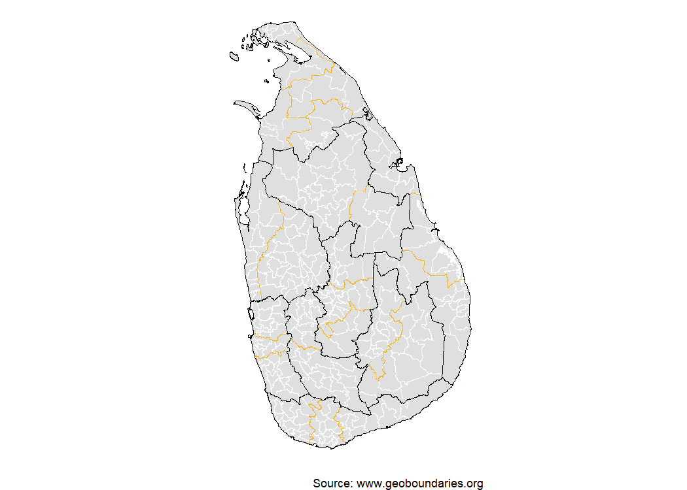

<!-- README.md is generated from README.Rmd. Please edit that file -->

# geobounds 

<!-- badges: start -->

[](https://github.com/dieghernan/geobounds/actions/workflows/check-full.yaml)
[](https://github.com/dieghernan/geobounds/actions/workflows/rhub.yaml)
[](https://app.codecov.io/gh/dieghernan/geobounds)
[](https://dieghernan.r-universe.dev/geobounds)
[](https://www.codefactor.io/repository/github/dieghernan/geobounds)
[](https://www.repostatus.org/#concept)

<!-- badges: end -->

## Why this package?

The **geobounds** package provides an R-friendly interface to access and
work with the [**geoBoundaries**](https://www.geoboundaries.org/)
dataset (an open-license global database of administrative boundary
polygons). Using this package, you can:

- Programmatically retrieve administrative boundary geometries (e.g.,
  country → region → district) from geoBoundaries  
- Use tidyverse / **sf** workflows in **R** to map, analyse and join
  these boundaries with your own data  
- Work in an open-data context (geoBoundaries uses CC BY-4.0 / open
  licences)

In short: if you work with geospatial boundaries in **R** (shape files,
polygons, join with other data), this package simplifies the process.

## Installation

You can install the developing version of **geobounds** with:

``` r
# install.packages("pak")
pak::pak("dieghernan/geobounds")
```

Alternatively, you can install **geobounds** using the
[r-universe](https://dieghernan.r-universe.dev/geobounds):

``` r
# Install geobounds in R:
install.packages("geobounds",
  repos = c(
    "https://dieghernan.r-universe.dev",
    "https://cloud.r-project.org"
  )
)
```

## Example usage

``` r
library(geobounds)

sri_lanka_bounds <- get_geobn("Sri Lanka")
sri_lanka_adm1 <- get_geobn("Sri Lanka", boundary_type = "ADM1")

library(sf)
#> Linking to GEOS 3.13.1, GDAL 3.10.2, PROJ 9.5.1; sf_use_s2() is TRUE
library(dplyr)
#> 
#> Adjuntando el paquete: 'dplyr'
#> The following objects are masked from 'package:stats':
#> 
#>     filter, lag
#> The following objects are masked from 'package:base':
#> 
#>     intersect, setdiff, setequal, union

# Central
central <- sri_lanka_adm1 %>%
  filter(shapeISO == "LK-2")

library(ggplot2)

ggplot(sri_lanka_bounds) +
  geom_sf(fill = "#F6E1B9") +
  geom_sf(data = sri_lanka_adm1, fill = NA) +
  geom_sf(data = central, fill = "#C12838") +
  theme_void() +
  theme(
    panel.background = element_rect(fill = "#C7E7FB")
  ) +
  labs(
    title = "Central Province, Sri Lanka",
    caption = "Source: geoBoundaries"
  )
```



> Note: This is a simple illustration. See the package vignettes for
> full details on parameters, filters, caching, and advanced usage.

## Documentation & Resources

- Visit the **pkgdown** site for full documentation:
  <https://dieghernan.github.io/geobounds/>
- Explore the geoBoundaries homepage: <https://www.geoboundaries.org/>
- Read the original paper describing the geoBoundaries dataset ([Runfola
  et al. 2020](#ref-geoboundaries)).

## License

This package is released under the CC BY-4.0 license. See the
`LICENSE.md` file for full details. Note that the boundary data being
accessed (via geoBoundaries) also uses open licences; please check the
specific dataset metadata for licensing details.

## Acknowledgements

- Many thanks to the geoBoundaries team and the William & Mary geoLab
  for creating and maintaining the dataset. 
- Thanks to the **R** package community and all contributors to this
  package’s development.
- If you use **geobounds** (and underlying geoBoundaries data) in your
  research or project, a citation and acknowledgement is greatly
  appreciated.

## Citation

<p>

Hernangómez D (2025). <em>geobounds: Download Map Data from
geoBoundaries</em>.
<a href="https://dieghernan.github.io/geobounds/">https://dieghernan.github.io/geobounds/</a>.
</p>

A BibTeX entry for LaTeX users:

    @Manual{R-geobounds,
      title = {{geobounds}: Download Map Data from geoBoundaries},
      author = {Diego Hernangómez},
      year = {2025},
      version = {0.0.0.9000},
      url = {https://dieghernan.github.io/geobounds/},
      abstract = {Tools to download data from geoBoundaries <https://www.geoboundaries.org/>. Several administration levels available. See Runfola, D. et al. (2020) geoBoundaries: A global database of political administrative boundaries. PLoS ONE 15(4): e0231866. <doi:10.1371/journal.pone.0231866>.},
    }

## References

<div id="refs" class="references csl-bib-body hanging-indent"
entry-spacing="0">

<div id="ref-geoboundaries" class="csl-entry">

Runfola, Daniel, Austin Anderson, Heather Baier, Matt Crittenden,
Elizabeth Dowker, Sydney Fuhrig, Seth Goodman, et al. 2020.
“geoBoundaries: A Global Database of Political Administrative
Boundaries.” *PLOS ONE* 15 (4): 1–9.
<https://doi.org/10.1371/journal.pone.0231866>.

</div>

</div>
