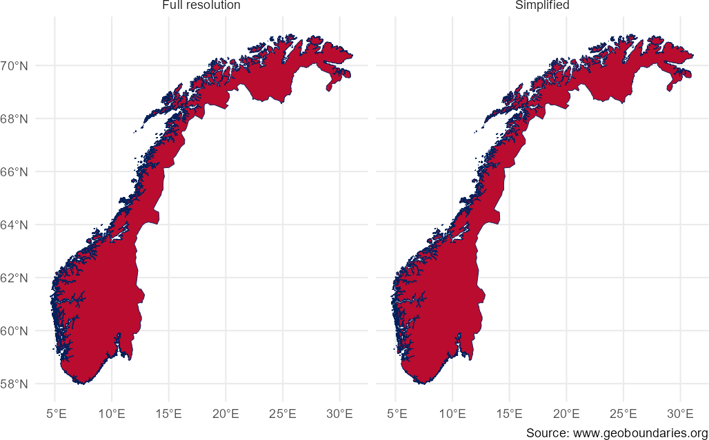
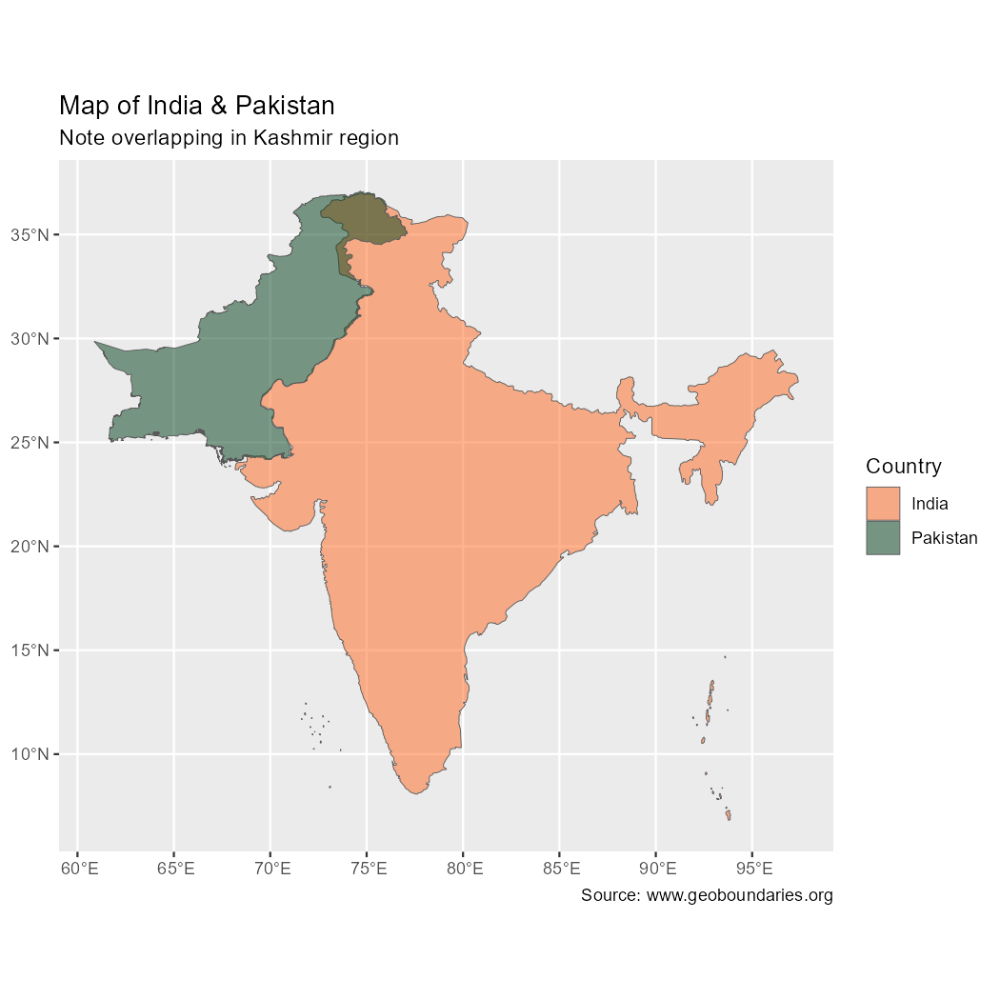
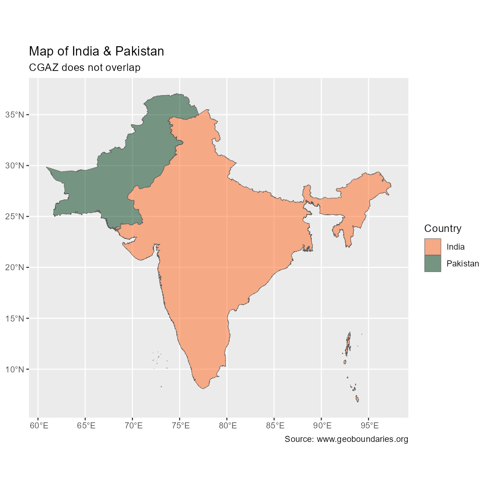
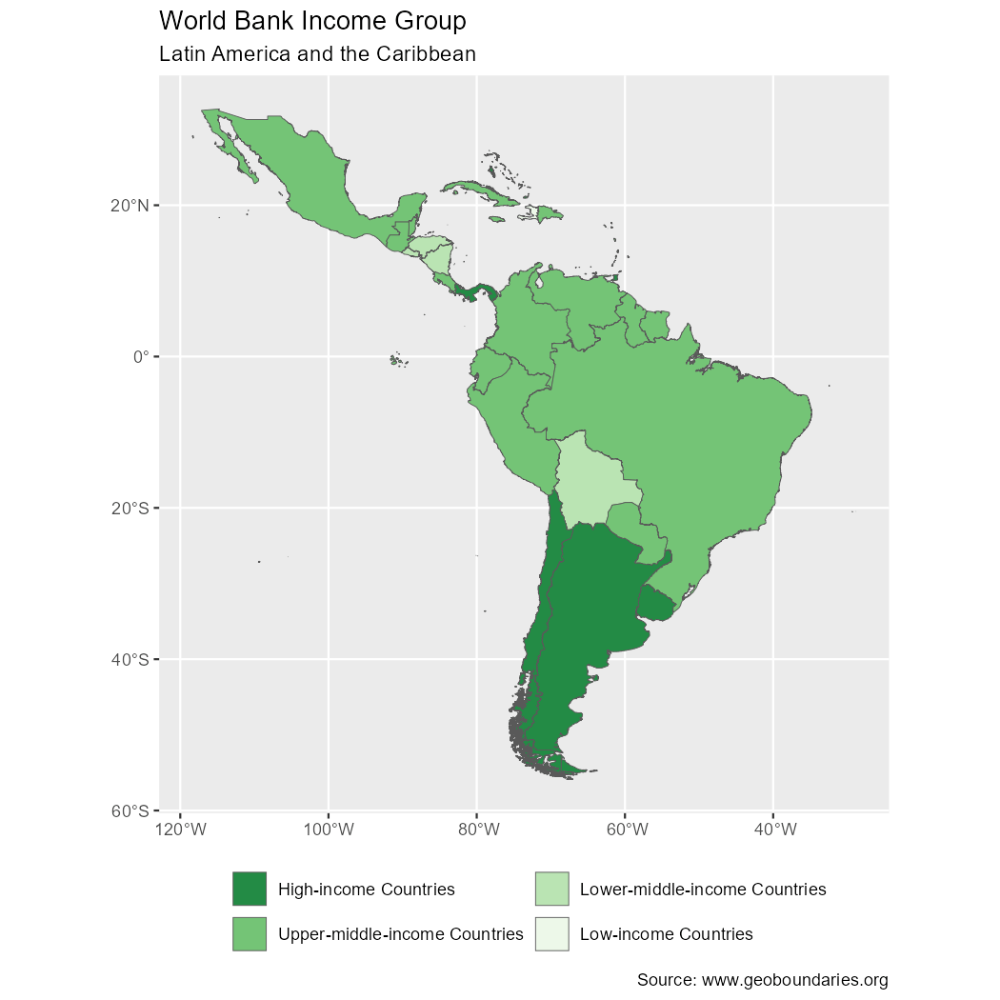

<!-- geobounds.Rmd is generated from geobounds.Rmd.orig. Please edit that file -->


[**Attribution**](https://www.geoboundaries.org/index.html#usage) **is required
when using geoBoundaries.**

## Introduction

The **geobounds** package provides a straightforward interface for downloading
and working with global political and administrative boundary data from the
[geoBoundaries](https://www.geoboundaries.org/) project [@geoboundaries].\
These datasets are openly licensed ([CC BY
4.0](https://creativecommons.org/licenses/by/4.0/)) and cover countries
worldwide across multiple administrative levels. With **geobounds**, you can
easily fetch boundary geometries as `sf` objects, explore metadata, cache
datasets locally, and seamlessly integrate the boundaries into your spatial
workflows.

## Understanding the data

The geoBoundaries database undergoes a rigorous quality assurance process,
including manual review and hand-digitization of physical maps where necessary.
Its primary goal is to provide the highest possible level of spatial accuracy
for scientific and academic applications.

This precision comes at a cost: some files can be quite large and may take
longer to download. For visualization or general mapping purposes, we recommend
using the simplified datasets available by setting `simplified = TRUE`.


``` r
library(geobounds)
library(ggplot2)
library(dplyr)

# Different resolutions
norway <- get_geobn_adm0("NOR") %>%
  mutate(res = "Full resolution")
print(object.size(norway), units = "Mb")
#> 26.5 Mb

norway_simp <- get_geobn_adm0(country = "NOR", simplified = TRUE) %>%
  mutate(res = "Simplified")
print(object.size(norway_simp), units = "Mb")
#> 1.5 Mb

norway_all <- bind_rows(norway, norway_simp)

# Plot ggplot2

library(ggplot2)

ggplot(norway_all) +
  geom_sf(fill = "#BA0C2F") +
  facet_wrap(vars(res)) +
  theme_minimal() +
  labs(caption = "Source: www.geoboundaries.org")
```

<div class="figure">

<p class="caption">Comparison between full vs. simplified map.</p>
</div>

### Individual country files

The geoBoundaries API provides [individual country
files](https://www.geoboundaries.org/countryDownloads.html), whose aim is to
represent every nation "as they would represent themselves", with no special
identification of disputed areas.

The download of this data is implemented in `get_geobn()` and the
`get_geobn_adm*()` family of functions. It is not guaranteed that borders align
perfectly or that there are no gaps between countries. Additionally, these files
do not include a special identification of disputed areas.


``` r
# Files may intersect
check_int <- get_geobn(c("Austria", "Germany"))

# Intersects?
sf::st_intersects(check_int[1, ], check_int[2, ], sparse = FALSE) %>%
  as.vector()
#> [1] TRUE

# Disputed areas e.g. Morocco includes Western Sahara

mor <- get_geobn_adm0("Morocco")

ggplot(mor) +
  geom_sf() +
  labs(caption = "Source: www.geoboundaries.org")
```

<div class="figure">

<p class="caption">Map showing Western Sahara as part of Morocco.</p>
</div>

### Composite files

If you would prefer data that explicitly includes disputed areas, please use
`get_geobn_world()`. This function downloads global composite datasets for
administrative boundaries, also known as CGAZ (Comprehensive Global
Administrative Zones). There are two important distinctions between CGAZ and
individual country downloads:

1.  Extensive simplification is performed to ensure that file sizes are small
    enough to be used in most traditional desktop software.

2.  Disputed areas are removed and replaced with polygons following US
    Department of State definitions.


``` r
mor_cgaz <- get_geobn_world() %>%
  filter(shapeGroup == "MAR")

ggplot(mor_cgaz) +
  geom_sf() +
  labs(caption = "Source: www.geoboundaries.org")
```

<div class="figure">

<p class="caption">Map showing Morocco as provided by CGAZ.</p>
</div>

## Caching and performance

The package provides a built-in mechanism to cache files locally so that
repeated downloads for the same country/level will use the cached version. For
example:


``` r
# Current folder
current <- geobn_detect_cache_dir()

current
#> [1] "C:\\Users\\RUNNER~1\\AppData\\Local\\Temp\\RtmpyIkR4g"

# Change to new
newdir <- file.path(tempdir(), "/geoboundvignette")
geobn_set_cache_dir(newdir)
#> ℹ geobounds cache dir is 'C:\Users\RUNNER~1\AppData\Local\Temp\RtmpyIkR4g//geoboundvignette'.
#> ℹ To install your `cache_dir` path for use in future sessions run this function with `install = TRUE`.

# Download
example <- get_geobn_adm0("Vatican City", verbose = TRUE)
#> ℹ Downloading file from <https://github.com/wmgeolab/geoBoundaries/raw/9469f09/releaseData/gbOpen/VAT/ADM0/geoBoundaries-VAT-ADM0.geojson>
#> ℹ Cache dir is 'C:\Users\RUNNER~1\AppData\Local\Temp\RtmpyIkR4g//geoboundvignette/gbOpen'

# Restore cache dir
geobn_set_cache_dir(current)
#> ℹ geobounds cache dir is 'C:\Users\RUNNER~1\AppData\Local\Temp\RtmpyIkR4g'.
#> ℹ To install your `cache_dir` path for use in future sessions run this function with `install = TRUE`.

current == geobn_detect_cache_dir()
#> [1] TRUE
```


Specific cache directories on each function call can be set using the
`cache_dir` argument of each function.

## Use in spatial analysis pipelines

Because the boundaries are returned as `sf` objects, you can easily use them in
combination with other spatial data:

-   Clip raster data to administrative units
-   Compute zonal statistics
-   Create choropleth maps
-   Perform spatial joins with survey or tabular data

In this example we would create a choropleth map using the metadata of the
individual files and the boundaries data of CGAZ:


``` r
# Metadata

latam_meta <- get_geobn_meta(boundary_type = "ADM0") %>%
  select(boundaryISO, boundaryName, Continent, worldBankIncomeGroup) %>%
  filter(Continent == "Latin America and the Caribbean") %>%
  glimpse()
#> Rows: 47
#> Columns: 4
#> $ boundaryISO          <chr> "ABW", "AIA", "ARG", "ATG", "BES", "BHS", "BLM", …
#> $ boundaryName         <chr> "Aruba", "Anguilla", "Argentina", "Antigua and Ba…
#> $ Continent            <chr> "Latin America and the Caribbean", "Latin America…
#> $ worldBankIncomeGroup <chr> "High-income Countries", "No income group availab…

# Adjust factors
latam_meta$income_factor <- factor(latam_meta$worldBankIncomeGroup,
  levels = c(
    "High-income Countries",
    "Upper-middle-income Countries",
    "Lower-middle-income Countries",
    "Low-income Countries"
  )
)

# Get the shapes from CGAZ
latam_sf <- get_geobn_world(boundary_type = "ADM0") %>%
  inner_join(latam_meta,
    by =
      c("shapeGroup" = "boundaryISO")
  )

ggplot(latam_sf) +
  geom_sf(aes(fill = income_factor)) +
  scale_fill_brewer(palette = "Greens", direction = -1) +
  guides(fill = guide_legend(position = "bottom", nrow = 2)) +
  labs(
    title = "World Bank Income Group",
    subtitle = "Latin America and the Caribbean",
    fill = "",
    caption = "Source: www.geoboundaries.org"
  )
```

<div class="figure">

<p class="caption">World Bank Income Group: Latin America and the Caribbean </p>
</div>

## Summary

The **geobounds** package makes it easy to fetch, manage and visualise
administrative boundary data worldwide in a reproducible and efficient way.
Whether you're doing mapping, spatial analysis, survey integration or geospatial
modelling, it gives you a high-quality boundary dataset with minimal overhead.

## References
